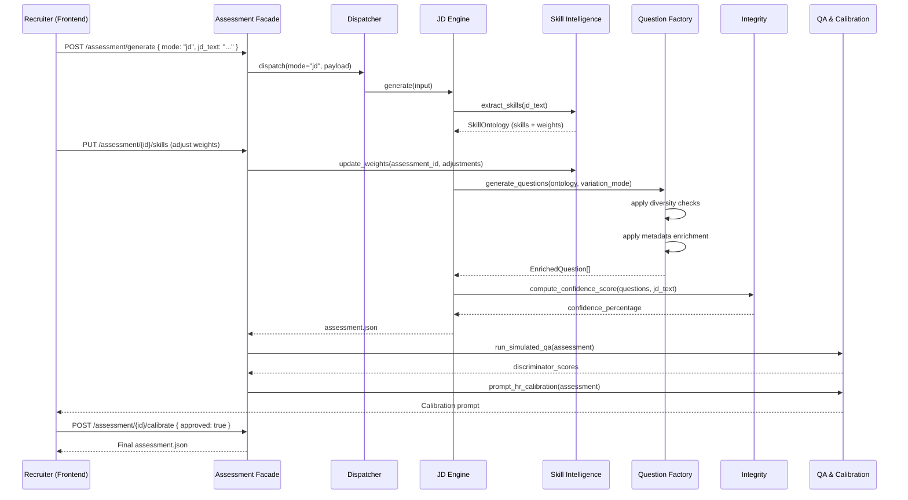
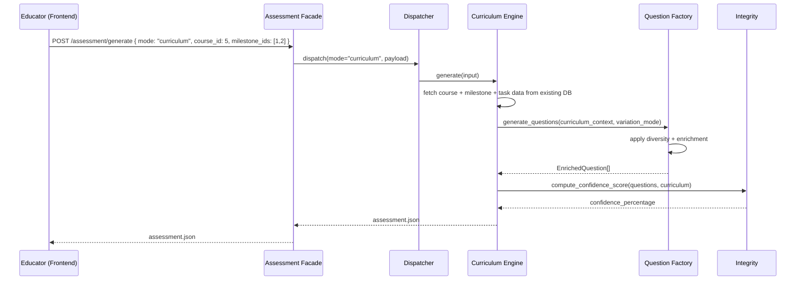
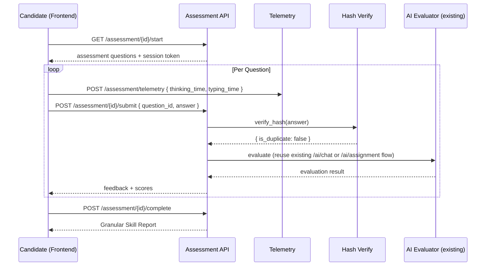
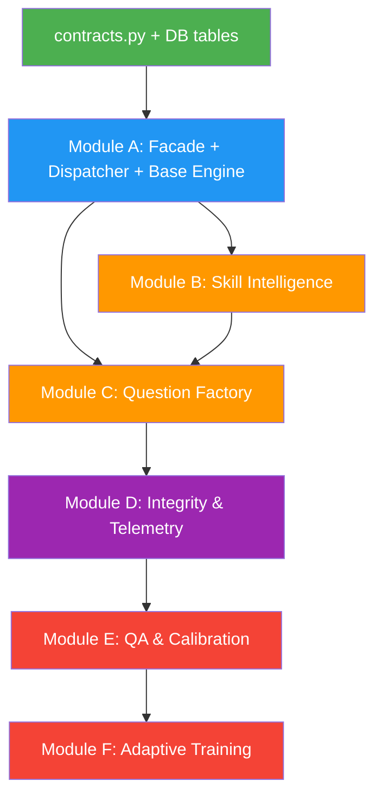

# Architecture Specification: SensAI Assessment Intelligence Suite

## 1. Architectural Overview

The Assessment Intelligence Suite introduces **six logical modules** into the existing SensAI backend. These modules are grouped by **domain cohesion**, not by the original feature tiers. Each tier label (T1/T2/T3/Future) is appended for priority reference.

```
┌─────────────────────────────────────────────────────────────────────┐
│                        EXISTING SENSAI APP                         │
│  ┌──────────┐  ┌──────────┐  ┌──────────┐  ┌───────────────────┐  │
│  │ routes/* │  │  db/*    │  │ models.py│  │ llm.py            │  │
│  │ (FastAPI │  │(aiosqlite│  │(Pydantic)│  │(OpenAI + Langfuse)│  │
│  │ routers) │  │  DAL)    │  │          │  │                   │  │
│  └────┬─────┘  └────┬─────┘  └────┬─────┘  └────────┬──────────┘  │
│       │              │             │                  │             │
├───────┼──────────────┼─────────────┼──────────────────┼─────────────┤
│       │      NEW ASSESSMENT INTELLIGENCE LAYER       │             │
│       ▼              ▼             ▼                  ▼             │
│  ┌─────────────────────────────────────────────────────────────┐   │
│  │              Module A: Assessment Facade                    │   │
│  │   (Unified API surface + Dispatcher → Strategy engines)     │   │
│  └──────┬───────────────────────────────────────────┬──────────┘   │
│         │                                           │              │
│  ┌──────▼──────┐                          ┌─────────▼──────────┐   │
│  │  Module B:  │                          │    Module C:        │   │
│  │  Skill      │                          │    Question         │   │
│  │  Intelligence│                         │    Factory          │   │
│  │  (Ontology +│                          │    (Generation +    │   │
│  │  Reporting) │                          │    Diversity +      │   │
│  └──────┬──────┘                          │    Metadata)        │   │
│         │                                 └─────────┬──────────┘   │
│         │                                           │              │
│  ┌──────▼──────────────────────────────────────────▼───────────┐   │
│  │              Module D: Integrity & Telemetry                │   │
│  │   (Hash Verification, Time Logs, Confidence Score)          │   │
│  └─────────────────────────────┬───────────────────────────────┘   │
│                                │                                   │
│  ┌─────────────────────────────▼───────────────────────────────┐   │
│  │              Module E: QA & Calibration                     │   │
│  │   (Simulated Candidates, HR Calibration)                    │   │
│  └─────────────────────────────┬───────────────────────────────┘   │
│                                │                                   │
│  ┌─────────────────────────────▼───────────────────────────────┐   │
│  │              Module F: Adaptive Training                    │   │
│  │   (Post-assessment Trainer Flow)                            │   │
│  └─────────────────────────────────────────────────────────────┘   │
└─────────────────────────────────────────────────────────────────────┘
```

---

## 2. Module Decomposition

### Module A: Assessment Facade (T1 — Foundation)

**Purpose:** Single unified entry point for all assessment operations. Implements the **Facade + Strategy Pattern** to route requests to the correct generation engine.

**Design Pattern:** Facade (public API surface) + Strategy (pluggable engine selection) + Factory Method (engine instantiation)

**Features Mapped:**
- Facade API surface (all tiers)
- Dispatcher: Curriculum Mode vs. JD Mode

**Integration Points with Existing Code:**
- **New router:** `routes/assessment.py` → registered in `main.py`
- **Consumes:** `llm.py` (LLM calls), `models.py` (shared Pydantic models)
- **Produces:** `assessment.json` output contract

**Key Components:**

```
src/api/
├── assessment/                     # NEW package
│   ├── __init__.py
│   ├── facade.py                   # AssessmentFacade class
│   ├── dispatcher.py               # Strategy dispatcher
│   ├── engines/
│   │   ├── __init__.py
│   │   ├── base.py                 # AbstractAssessmentEngine (ABC)
│   │   ├── curriculum_engine.py    # CurriculumAssessmentEngine
│   │   └── jd_engine.py            # JDAssessmentEngine
│   └── contracts.py                # Shared Pydantic models for assessment.json
```

**Loose Coupling Mechanism:**
- `AbstractAssessmentEngine` defines the contract: `async def generate(self, input: EngineInput) -> AssessmentOutput`
- The Dispatcher selects the engine based on `assessment_mode` in the request
- New engines (e.g., future "Hybrid" mode) can be added by subclassing `AbstractAssessmentEngine` and registering in the dispatcher

---

### Module B: Skill Intelligence (T1 — Foundation)

**Purpose:** Handles skill extraction, ontology management, and granular competency reporting.

**Design Pattern:** Pipeline Pattern (two-step extraction → adjustment → reporting)

**Features Mapped:**
- Skill Ontology Extraction (T1)
- Granular Skill Reporting (T1)

**Integration Points:**
- **Receives JD text** from Module A (JD Engine)
- **Provides skill map** to Module C (Question Factory) for question generation
- **Provides competency report** to frontend via new API endpoints
- **New DB tables:** `skill_ontologies`, `skill_ontology_items`, `assessment_skill_reports`

**Key Components:**

```
src/api/
├── assessment/
│   ├── skills/
│   │   ├── __init__.py
│   │   ├── extractor.py            # JD → raw skill ontology (LLM step 1)
│   │   ├── ontology.py             # Skill tree data structures + weight adjustment
│   │   └── reporter.py             # Granular competency map generator
```

---

### Module C: Question Factory (T2 — Integrity & Scaling)

**Purpose:** Generates, diversifies, and enriches assessment questions.

**Design Pattern:** Builder Pattern (metadata enrichment) + Strategy (variation modes)

**Features Mapped:**
- Semantic Diversity Engine (T2)
- Dynamic Assessment Modes: Static, Variable Swap, Isomorphic Shuffle (T2)
- Metadata Enrichment: Skill Tested, Difficulty Reason, Learning Objective (T2)

**Integration Points:**
- **Receives:** Skill ontology from Module B, curriculum context from existing course/task data
- **Produces:** Enriched question objects for `assessment.json`
- **Consumes:** `llm.py` for generation, existing `db/task.py` for curriculum questions
- **New tables:** `question_metadata`, `question_hashes` (also used by Module D)

**Key Components:**

```
src/api/
├── assessment/
│   ├── questions/
│   │   ├── __init__.py
│   │   ├── factory.py               # Question generation orchestrator
│   │   ├── diversity.py             # Semantic similarity checks
│   │   ├── variation.py             # Static / Variable Swap / Isomorphic strategies
│   │   └── enrichment.py            # Metadata attachment (skill, difficulty, objective)
```

**Variation Mode Strategy:**

```python
# variation.py — Strategy Pattern
class VariationStrategy(ABC):
    @abstractmethod
    async def apply(self, base_question: QuestionTemplate, context: VariationContext) -> EnrichedQuestion: ...

class StaticVariation(VariationStrategy): ...       # No modification
class VariableSwapVariation(VariationStrategy): ... # Parameter substitution
class IsomorphicShuffleVariation(VariationStrategy): ... # Structural redesign
```

---

### Module D: Integrity & Telemetry (T1 + T2)

**Purpose:** Ensures assessment integrity and captures behavioral telemetry.

**Design Pattern:** Observer Pattern (telemetry events) + Decorator (hash verification wrapping)

**Features Mapped:**
- Granular Time Logs: Thinking Time vs. Typing Time (T1)
- Leaderboard Confidence Score (T1)
- Hash Verification: SHA-256 copy-paste detection (T2)

**Integration Points:**
- **Time Logs:** Frontend emits events → new `/assessment/telemetry` endpoint → `assessment_telemetry` table
- **Confidence Score:** Calculated post-generation by comparing assessment output to source JD/curriculum → stored in `assessment.json`
- **Hash Verification:** Computed at submission time, stored in `submission_hashes` table, compared against `question_hashes`
- **Existing touchpoint:** Extends `chat_history` table or creates a parallel `assessment_submissions` table

**Key Components:**

```
src/api/
├── assessment/
│   ├── integrity/
│   │   ├── __init__.py
│   │   ├── telemetry.py             # Time log ingestion + storage
│   │   ├── confidence.py            # JD/Curriculum coverage score
│   │   └── hash_verify.py           # SHA-256 duplicate detection
```

**Telemetry Event Schema:**

```json
{
  "event_type": "keystroke_session",
  "assessment_id": "uuid",
  "question_id": 42,
  "user_id": 7,
  "thinking_time_ms": 12400,
  "typing_time_ms": 45200,
  "idle_periods": [{ "start_ms": 3000, "end_ms": 8500 }],
  "timestamp": "2026-04-10T12:00:00Z"
}
```

---

### Module E: QA & Calibration (T3 — Advanced Intelligence)

**Purpose:** Pre-live quality assurance and difficulty calibration.

**Design Pattern:** Template Method (QA pipeline stages) + Mediator (HR ↔ System calibration loop)

**Features Mapped:**
- Simulated Candidate QA via AI Personas (T3)
- HR Calibration auto-prompts (T3)

**Integration Points:**
- **Receives:** Generated `assessment.json` from Module A
- **Produces:** Annotated assessment with discriminator scores + HR approval status
- **No direct DB impact on existing tables;** new tables: `qa_simulation_results`, `hr_calibration_log`
- **Consumes:** `llm.py` for persona simulation

**Key Components:**

```
src/api/
├── assessment/
│   ├── qa/
│   │   ├── __init__.py
│   │   ├── simulator.py            # AI Persona test runner (Beginner/Intermediate/Expert)
│   │   ├── discriminator.py        # "Good Discriminator" scoring
│   │   └── calibration.py          # HR difficulty confirmation flow
```

---

### Module F: Adaptive Training (T3 — Advanced Intelligence)

**Purpose:** Post-assessment adaptive drill generation.

**Design Pattern:** Strategy (drill generation modes) + Composite (aggregated weakness profiles)

**Features Mapped:**
- Trainer Flow / Adaptive Drills (T3)

**Integration Points:**
- **Receives:** Completed assessment results (scores, incorrect answers)
- **Produces:** Personalized practice question sets (never used for comparative grading)
- **Consumes:** Module B (skill ontology) for targeted drill generation
- **New tables:** `trainer_sessions`, `trainer_questions`

**Key Components:**

```
src/api/
├── assessment/
│   ├── training/
│   │   ├── __init__.py
│   │   ├── generator.py            # Drill question generator
│   │   └── profiler.py             # Weakness profile aggregator
```

---

## 3. Future Enhancement Hooks

These are **not implemented now** but the architecture must accommodate them cleanly.

### LLM Flagging & Constraints (Future)
- **Hook Location:** Module C (`questions/factory.py`) — add a `ConstraintInjector` middleware in the generation pipeline
- **Design:** Decorator wrapping the LLM prompt to inject logical constraints that break standard LLM patterns
- **Preparation:** The `EnrichedQuestion` model in `contracts.py` should include an optional `constraints: List[ConstraintRule]` field

### Intuition Check (Future)
- **Hook Location:** Module D (`integrity/`) — add an `intuition_check.py` module
- **Design:** Pre-code logic capture endpoint that stores a candidate's stated plan, then a post-code comparator that detects plan↔code mismatches
- **Preparation:** The `assessment_telemetry` table should include an `event_type = "plan_capture"` variant

---

## 4. Complete File System Layout

```
src/api/
├── assessment/                          # ← ALL NEW CODE LIVES HERE
│   ├── __init__.py                      # Package init, version
│   ├── facade.py                        # Module A: Public interface
│   ├── dispatcher.py                    # Module A: Strategy router
│   ├── contracts.py                     # Shared: assessment.json Pydantic models
│   │
│   ├── engines/                         # Module A: Generation engines
│   │   ├── __init__.py
│   │   ├── base.py                      # ABC for engines
│   │   ├── curriculum_engine.py         # Curriculum-mode generation
│   │   └── jd_engine.py                 # JD-mode generation
│   │
│   ├── skills/                          # Module B: Skill Intelligence
│   │   ├── __init__.py
│   │   ├── extractor.py                 # JD parser (2-step)
│   │   ├── ontology.py                  # Skill tree + weight adjustment
│   │   └── reporter.py                  # Competency map
│   │
│   ├── questions/                       # Module C: Question Factory
│   │   ├── __init__.py
│   │   ├── factory.py                   # Orchestrator
│   │   ├── diversity.py                 # Semantic similarity
│   │   ├── variation.py                 # Mode strategies
│   │   └── enrichment.py               # Metadata attachment
│   │
│   ├── integrity/                       # Module D: Integrity & Telemetry
│   │   ├── __init__.py
│   │   ├── telemetry.py                 # Time logs
│   │   ├── confidence.py                # Coverage scoring
│   │   └── hash_verify.py              # SHA-256
│   │
│   ├── qa/                              # Module E: QA & Calibration
│   │   ├── __init__.py
│   │   ├── simulator.py                 # AI Personas
│   │   ├── discriminator.py             # Quality scoring
│   │   └── calibration.py              # HR flow
│   │
│   └── training/                        # Module F: Adaptive Training
│       ├── __init__.py
│       ├── generator.py                 # Drill generation
│       └── profiler.py                  # Weakness analyzer
│
├── routes/
│   ├── assessment.py                    # NEW: Assessment API router
│   └── ... (existing routers untouched)
│
├── db/
│   ├── assessment.py                    # NEW: Assessment DAL
│   └── ... (existing DAL untouched)
│
├── models.py                            # MODIFIED: +assessment models (append-only)
├── config.py                            # MODIFIED: +new table names (append-only)
├── main.py                              # MODIFIED: +1 router registration line
└── ...
```

---

## 5. Integration with Existing App — Touchpoints

The design follows a **minimal-impact, append-only** strategy. Existing files are modified only by adding new lines; no existing logic is altered.

| Existing File | Change Type | What Changes |
|---|---|---|
| `main.py` | **Append** | Add `from api.routes import assessment` and `app.include_router(assessment.router, prefix="/assessment", tags=["assessment"])` |
| `config.py` | **Append** | Add new table name constants (e.g., `assessments_table_name`, `skill_ontologies_table_name`, etc.) |
| `models.py` | **Append** | Add assessment-related Pydantic request/response models (they can also live in `assessment/contracts.py` and be imported) |
| `db/__init__.py` | **Append** | Add `create_assessments_table()`, `create_skill_ontologies_table()`, etc. in `init_db()` and migrations |
| `settings.py` | **Append** | Add optional config keys (e.g., `embedding_model_name` for semantic diversity, if needed) |

**Zero modifications to:**
- Any existing route file (`routes/ai.py`, `routes/task.py`, etc.)
- Any existing DB DAL file (`db/task.py`, `db/course.py`, etc.)
- Any frontend component (until frontend integration phase)

---

## 6. Data Flow Diagrams

### 6.1 JD-Driven Assessment Generation



### 6.2 Curriculum-Driven Assessment Generation



### 6.3 Candidate Assessment Session (Runtime)



---

## 7. Design Pattern Summary

| Pattern | Where Applied | Rationale |
|---|---|---|
| **Facade** | Module A (`facade.py`) | Single entry point hides the complexity of 6 internal modules |
| **Strategy** | Module A (`dispatcher.py`), Module C (`variation.py`) | Pluggable engine selection and variation mode selection without conditionals |
| **Abstract Factory** | Module A (`engines/base.py`) | Common contract for all generation engines |
| **Pipeline** | Module B (`extractor.py` → `ontology.py` → `reporter.py`) | Sequential transformation of JD → skills → report |
| **Builder** | Module C (`enrichment.py`) | Incremental metadata attachment to question objects |
| **Observer** | Module D (`telemetry.py`) | Decoupled event ingestion for behavioral data |
| **Decorator** | Module D (`hash_verify.py`) | Non-invasive hash computation wrapping existing submission flow |
| **Template Method** | Module E (`simulator.py`) | Standardized QA pipeline with customizable persona steps |
| **Mediator** | Module E (`calibration.py`) | Coordinated HR↔System feedback loop |
| **Composite** | Module F (`profiler.py`) | Aggregated weakness profiles from multiple question results |

---

## 8. New Database Tables

All new tables follow existing conventions: auto-increment PK, `created_at`/`updated_at`/`deleted_at` soft-delete timestamps, foreign keys with ON DELETE CASCADE.

| Table | Module | Purpose |
|---|---|---|
| `assessments` | A | Core assessment records (links to org, mode, status, `assessment_json`) |
| `skill_ontologies` | B | Ontology header (linked to assessment, JD source) |
| `skill_ontology_items` | B | Individual skills within an ontology (name, weight, parent_id for hierarchy) |
| `assessment_skill_reports` | B | Per-candidate competency scores per skill |
| `question_metadata` | C | Enriched metadata per question (skill_tested, difficulty_reason, learning_objective) |
| `question_hashes` | C/D | SHA-256 hashes of generated questions for copy-paste detection |
| `submission_hashes` | D | SHA-256 hashes of candidate submissions |
| `assessment_telemetry` | D | Thinking/typing time events per question per user |
| `qa_simulation_results` | E | AI persona test results (Beginner/Intermediate/Expert responses + scores) |
| `hr_calibration_log` | E | HR approval/rejection records with reasoning |
| `trainer_sessions` | F | Adaptive drill sessions (linked to completed assessment) |
| `trainer_questions` | F | Generated practice questions within a trainer session |

---

## 9. Dependency Graph (Build Order)

Implementation should follow this dependency order:



**Phase 1 (Foundation):** `contracts.py` → DB tables → Module A → Module B  
**Phase 2 (Generation):** Module C → Module D  
**Phase 3 (Intelligence):** Module E → Module F
